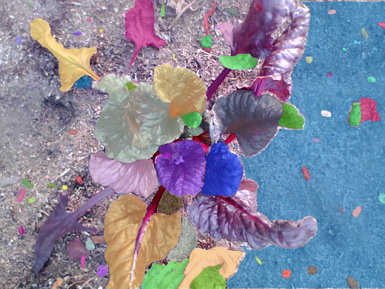

These examples showcase various ways in which you might use farmbot-py to augment and expand upon your FarmBot's capabilities.

# Copy Plants to New Account

[copy_plants_to_new_account.py](copy_plants_to_new_account.py)

This script will copy all plants from one FarmBot account to another. Note: It will not copy any associated water, height, or spread curves ids because they will not exist in the target account.

# Segment FarmBot Images

[segment_farmbot_images.py](segment_farmbot_images.py)

This script demonstrates how to use the Segment Anything Model (SAM) to segment images from a FarmBot account. See https://github.com/facebookresearch/segment-anything for additional installation requirements and to download a SAM model.

## Example 1: Segmenting an image of a plant

Input image:

`vit_l` model output:

## Example 2: Segmenting an image of the FarmBot toolbay and other objects

Input image:

`vit_l` model output:

